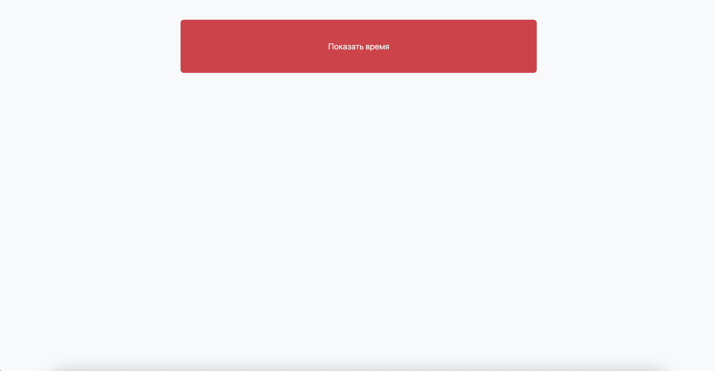
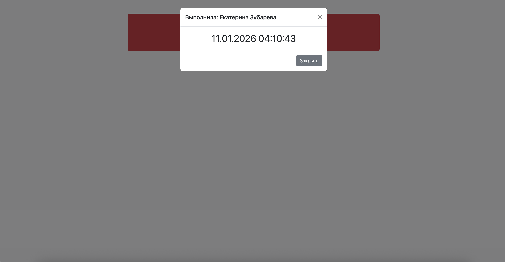

# Отчёт по лабораторной работе: Luxon + Bootstrap 5 на Vite

## 1. Цель работы

* Создать страницу с кнопкой, показывающей текущее время в модальном окне с использованием **Luxon**.
* Интегрировать **Bootstrap 5** минимально для контейнера, кнопки и модального окна.
* Собрать проект через **Vite**, минимизируя размер бандла.

---

## 2. Структура проекта

```
luxon-bootstrap-vite/
├─ index.html        // Главная страница с контейнером, кнопкой и модальным окном
├─ src/main.js       // Скрипт для отображения времени и управления модальным окном
├─ package.json      // Зависимости и скрипты сборки
└─ node_modules/     // Установленные пакеты
```

* `index.html` содержит контейнер Bootstrap, кнопку и модальное окно.
* `main.js` импортирует только нужные части Bootstrap (`Modal`) и Luxon.
* `package.json` содержит скрипты:

```json
"scripts": {
  "dev": "vite",
  "build": "vite build",
  "preview": "vite preview"
}
```

---

## 3. Скрипт работы времени (main.js)

```js
import { DateTime } from "luxon";
import Modal from "bootstrap/js/dist/modal";

const showTimeBtn = document.getElementById('showTimeBtn');
const modalBody = document.getElementById('modalBody');
const timeModal = new Modal(document.getElementById('timeModal'));

showTimeBtn.addEventListener('click', () => {
  const now = DateTime.now().toFormat("dd.MM.yyyy HH:mm:ss");
  modalBody.innerHTML = `<div class="text-center fs-2">${now}</div>`;
  timeModal.show();
});
```

---

## 4. Результат сборки

После выполнения команды:

```bash
npm run build
```

**Размер бандла:**

| Файл                        | Размер    | Gzip     |
| --------------------------- | --------- | -------- |
| `index.html`                | 1.32 KB   | 0.67 KB  |
| `assets/index-CfkJyshZ.css` | 231.25 KB | 30.69 KB |
| `assets/index-QGzhYrz9.js`  | 96.25 KB  | 29.87 KB |

Бандл минимизирован благодаря импортам только нужных частей Bootstrap и Luxon.

---

## 5. Скриншот UI





---

## 6. Публикация проекта

* Репозиторий: `https://github.com/zubarevaekaterina/luxon-bootstrap-vite`
* Статическая страница: `https://zubarevaekaterina.github.io/luxon-bootstrap-vite/`

Папка `dist/` используется для публикации на GitHub Pages или Netlify.

---

## 7. Вывод

* Успешно интегрированы Luxon и минимальный Bootstrap.
* Сборка через Vite прошла корректно, размер бандла оптимизирован.
* Показано время в модальном окне по нажатию кнопки.

**Команда для сборки проекта:**

```bash
npm run build
```

**Размер JS-бандла:** 96.25 KB
**Размер CSS:** 231.25 KB

---
